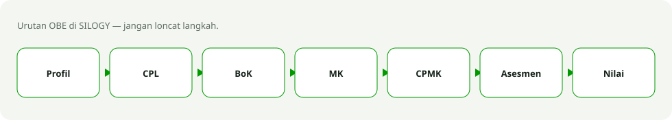
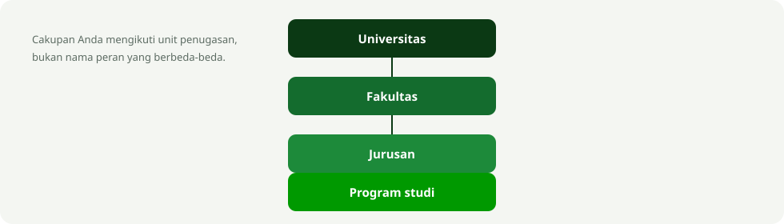

# Panduan Pengguna SILOGY

SILOGY adalah Sistem Informasi pengelolaan kurikulum berbasis **OBE (Outcome-Based Education)** di lingkungan Universitas Siliwangi. Sistem ini mengelola hirarki institusi, kurikulum (CPL → BoK → MK → CPMK → Sub-CPMK), kelas, penilaian capaian pembelajaran, hingga analisis berbasis AI.

Dokumen ini adalah indeks panduan. Setiap role memiliki panduan terpisah sesuai kewenangannya.

Panduan ini juga terbit sebagai halaman web publik di **/panduan** — tertaut langsung dari
beranda SILOGY, lengkap dengan tangkapan layar sistem yang sebenarnya. Alamat resmi:
[https://silogy.unsil.ac.id/login](https://silogy.unsil.ac.id/login).

## Daftar panduan per role

| Peran | Panduan (Markdown) | Halaman web |
|-------|--------------------|-------------|
| Super Admin | [01-super-admin.md](01-super-admin.md) | `/panduan/super-admin` |
| Admin Universitas / Fakultas / Jurusan / Program Studi | [02-admin-unit.md](02-admin-unit.md) | `/panduan/admin-unit` |
| Tim Kurikulum | [03-tim-kurikulum.md](03-tim-kurikulum.md) | `/panduan/tim-kurikulum` |
| Koordinator Mata Kuliah | [04-koordinator-mk.md](04-koordinator-mk.md) | `/panduan/koordinator-mk` |
| Dosen Pengampu | [05-dosen-pengampu.md](05-dosen-pengampu.md) | `/panduan/dosen-pengampu` |
| Pimpinan (Universitas/Fakultas/Jurusan/Prodi) | [06-pimpinan.md](06-pimpinan.md) | `/panduan/pimpinan` |
| Auditor Mutu | [07-auditor-mutu.md](07-auditor-mutu.md) | `/panduan/auditor-mutu` |
| Semua peran — alur end-to-end | [08-simulasi-penggunaan.md](08-simulasi-penggunaan.md) | `/panduan/alur-end-to-end` |

## Cara masuk (login)

1. Buka [https://silogy.unsil.ac.id/login](https://silogy.unsil.ac.id/login).
2. Masukkan **Username** (atau email, NIDN, NIP, NUPTK) dan **Password** akun Anda.
3. Klik **Masuk ke SILOGY**.

> Akun bawaan hasil seeding menggunakan pola username sederhana (mis. `superadmin`, `adminprodi`, `dosen`, `kaprodi`) dengan password awal `siliwangi`. **Segera ganti password** setelah login pertama melalui menu profil di pojok kanan atas.

Jika menggunakan 2FA (autentikasi dua faktor), masukkan kode dari aplikasi authenticator setelah password.

## Konsep penting

- **Unit akademik berjenjang**: Universitas → Fakultas → Jurusan → Program Studi. Kewenangan Anda mengikuti unit tempat Anda ditugaskan.
- **Alur kurikulum OBE**: Profil Lulusan → CPL (Capaian Pembelajaran Lulusan) → BoK (Body of Knowledge) → MK (Mata Kuliah) → CPMK → Sub-CPMK → Komponen Penilaian → Input Nilai → Laporan/Analisis.

Nama peran Admin atau Pimpinan sama di semua tingkat; yang membedakan adalah **unit penugasan**.
- **Menu yang tampil berbeda tiap role.** Jika sebuah menu tidak muncul, berarti role Anda tidak memiliki kewenangan tersebut.

## Navigasi umum (kelompok menu)

Institusi · Autentikasi · Kurikulum · Mata Kuliah · Kelas · Mahasiswa · Penilaian · AI Analisis · Audit. Menu yang aktif bergantung pada role.

## Bantuan

Hubungi Super Admin / Admin unit Anda untuk reset password, perubahan role, atau penambahan akun.
