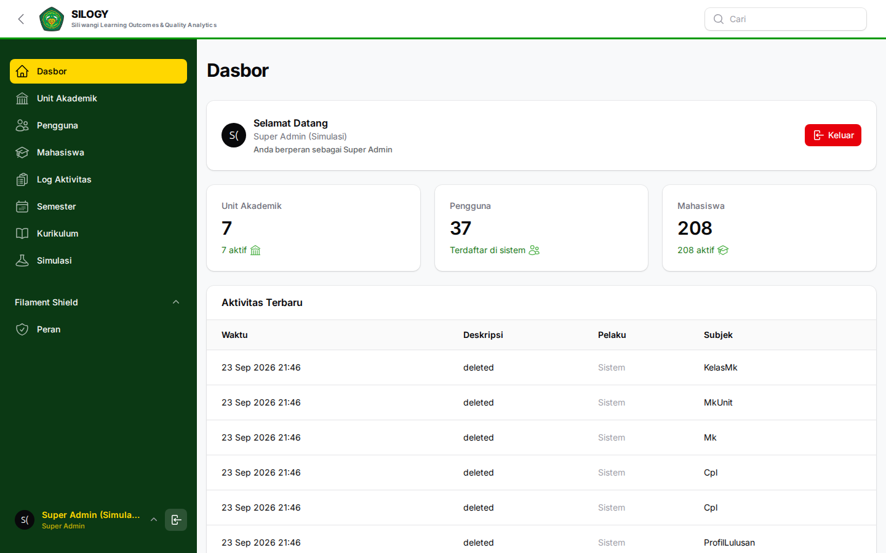
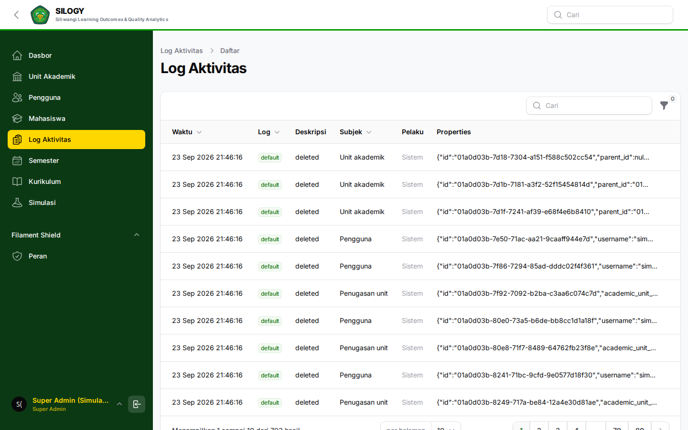
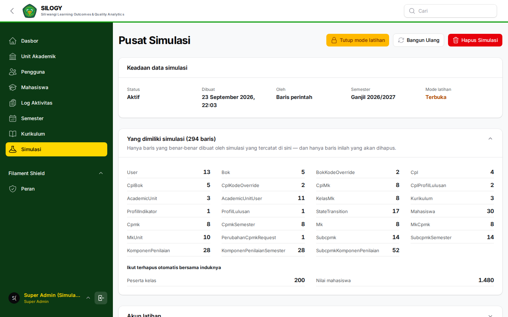

# Panduan Super Admin

Alamat SILOGY: **https://silogy.unsil.ac.id/login**

Super Admin adalah pengelola tertinggi sistem. Fokus kewenangannya pada **struktur institusi** dan **administrasi sistem (user, role, permission, audit, konfigurasi)**. Super Admin **tidak** mengelola isi kurikulum/penilaian secara langsung — itu kewenangan Tim Kurikulum, Koordinator MK, dan Dosen.

## Kewenangan utama

- Mengelola seluruh unit akademik: Universitas, Fakultas, Jurusan, Program Studi.
- Mengelola Semester dan Evaluasi.
- Mengelola User, Role, dan Permission di semua tingkat unit.
- Melihat Log Audit dan mengatur konfigurasi sistem.
- Menyalakan dan mematikan **data simulasi**, serta membuka atau menutup **mode latihan** di halaman panduan publik.

## Menu yang tersedia

- **Institusi → Unit Akademik**: buat dan susun hirarki universitas hingga prodi.
- **Autentikasi → Users**: kelola akun pengguna seluruh sistem.
- **Autentikasi → Roles / Permissions** (Filament Shield): atur peran dan hak akses.
- **Audit → Log Aktivitas**: pantau seluruh aktivitas pengguna.
- **Simulasi**: buat atau hapus data latihan kapan saja.

Dasbor Super Admin merangkum jumlah unit, pengguna, dan mahasiswa, serta aktivitas terbaru di seluruh sistem.

## Tugas yang sering dilakukan

### 1. Menyiapkan struktur institusi
1. Buka **Institusi → Unit Akademik**.
2. Klik **New / Buat** untuk membuat unit. Pilih **tipe** unit (university, faculty, department, study program) dan tetapkan **unit induk** agar hirarki benar.
3. Simpan. Ulangi hingga seluruh fakultas, jurusan, dan prodi terdaftar.

### 2. Membuat akun pengguna
1. Buka **Autentikasi → Users → New**.
2. Isi Username, Nama Lengkap, Email, NIDN (untuk dosen), dan password awal.
3. Tetapkan **Role** dan **Unit penugasan** (academic unit) yang sesuai.
4. Untuk pejabat, aktifkan status pimpinan; untuk anggota Tim Kurikulum, aktifkan status tim kurikulum pada unit prodi terkait.

### 3. Mengelola role & permission
1. Buka **Roles**. Pilih role yang ingin disesuaikan.
2. Centang/hapus permission sesuai kebutuhan, lalu simpan.
3. Hindari memberi permission berlebih — terapkan prinsip hak akses minimum.

### 4. Mengelola semester & evaluasi
- Aktifkan semester berjalan agar kelas dan penilaian merujuk ke periode yang benar.
- Buka/tutup periode evaluasi sesuai jadwal.

### 5. Memantau audit
- Buka **Audit → Log Aktivitas** untuk melihat siapa mengubah apa dan kapan. Gunakan filter untuk menelusuri kejadian tertentu.

### 6. Menyalakan dan mematikan data simulasi

Menu **Simulasi** menyediakan satu program studi contoh yang lengkap — dari kurikulum
sampai nilai dan hasil kalkulasi — supaya siapa pun bisa berlatih memakai SILOGY tanpa
menyentuh data yang sesungguhnya.

1. Buka **Simulasi**.
2. Klik **Buat Simulasi**. Proses berjalan langsung dan memakan waktu sekitar 10–60
   detik; jangan tutup halaman sampai muncul pemberitahuan selesai.
3. Setelah selesai, halaman menampilkan apa saja yang dibuat beserta daftar akun
   latihan (`sim-timkur`, `sim-korma`, `sim-dosen`, dan seterusnya) dengan kata sandi
   `siliwangi`.
4. Untuk membuangnya kembali, klik **Hapus Simulasi** lalu ketik `HAPUS SIMULASI`
   sebagai konfirmasi.

**Apa yang dibuat.** Simulasi membangun pohon unitnya sendiri — Universitas Simulasi →
Fakultas Simulasi → Prodi Simulasi — beserta akun `sim-*`, mahasiswa, kurikulum, CPL,
BoK, mata kuliah, CPMK, Sub-CPMK, komponen asesmen, kelas, nilai, dan hasil kalkulasi.

**Apa yang TIDAK disentuh.** Unit akademik yang sesungguhnya, akun pengguna nyata,
peran, izin, semester, dan master evaluasi. Karena akun simulasi hanya ditugaskan ke
unit simulasi, pengguna yang sedang berlatih tidak bisa mengubah data prodi yang asli.

**Penghapusan hanya membuang yang dibuatnya sendiri.** Sistem mencatat setiap baris yang
benar-benar lahir dari simulasi; baris yang sudah ada sebelumnya tidak pernah ikut
tercatat, sehingga tidak mungkin ikut terhapus. Tombol **Bangun Ulang** membongkar lalu
membangun kembali dari awal — berguna setelah banyak orang berlatih dan datanya menjadi
berantakan.

### 7. Membuka dan menutup mode latihan

Halaman panduan publik (`/panduan`) dapat menampilkan tombol **Coba sebagai ‹peran›**
yang memasukkan pengunjung langsung ke akun latihan **tanpa kata sandi**. Tombol itu
**tertutup secara bawaan**, dan Andalah yang memutuskan kapan dibuka.

1. Buka **Simulasi**.
2. Klik **Buka mode latihan**, lalu setujui peringatannya.
3. Bila sesi latihan sudah selesai, klik **Tutup mode latihan**.

Kolom **Mode latihan** pada kartu keadaan selalu menunjukkan posisi sakelarnya:
*Tertutup*, *Terbuka*, atau *Dikunci instans*.

**Yang perlu Anda pahami sebelum membuka.** Selama terbuka, siapa pun yang membuka
halaman panduan bisa masuk dan **menulis data** sebagai peran mana pun — Tim Kurikulum
bisa menyusun CPL, Dosen bisa mengisi nilai. Itu aman karena akun latihan hanya
ditugaskan ke unit simulasi sehingga tidak bisa menyentuh data yang sesungguhnya, tetapi
apa pun yang mereka ubah akan terlihat oleh pengunjung berikutnya. Gunakan **Bangun
Ulang** untuk mengembalikan data latihan ke kondisi semula.

**Sakelar ini menempel pada data simulasi.** Menghapus simulasi otomatis menutup mode
latihan, dan simulasi yang baru dibuat selalu mulai dari posisi tertutup. Anda tidak
perlu menyunting berkas konfigurasi apa pun di peladen.

> Jika tombol **Buka mode latihan** tidak muncul sama sekali dan keadaannya tertulis
> *Dikunci instans*, administrator peladen memang melarang mode latihan pada instans ini
> lewat `SIMULASI_IZINKAN_COBA_PERAN=false`. Hanya mereka yang dapat membukanya kembali.

> Dari baris perintah tersedia `php artisan simulasi:status`, `simulasi:buat`, dan
> `simulasi:hapus`. Tanpa `--terapkan`, perintah hapus hanya menampilkan laporan apa
> yang akan dibuang.

## Praktik baik

- Buat unit akademik terlebih dahulu sebelum membuat akun, agar penugasan unit bisa langsung dipilih.
- Gunakan satu role per akun sesuai fungsi; tambahkan penugasan unit untuk membatasi cakupan.
- Tinjau log audit secara berkala.
- Wajibkan penggantian password awal dan aktifkan 2FA untuk akun penting.

## Yang BUKAN kewenangan Super Admin

Penyusunan CPL, BoK, MK, CPMK, input nilai, dan permintaan analisis AI dilakukan oleh role akademik terkait, bukan Super Admin.
