# Panduan Tim Kurikulum

Cara masuk: [indeks panduan](00-README.md). Buku ini dimulai setelah kartu **Tim Kurikulum** aktif.

Tim Kurikulum menulis **kontrak capaian lulusan**: Kurikulum, Profil Lulusan (prodi), CPL, BoK, Mata Kuliah, Penawaran MK, dan matriks pemetaan. CPMK, asesmen, dan nilai dikerjakan Koordinator MK dan Dosen.

## Siapa Anda, menurut unit

Nama peran sama: **Tim Kurikulum**. Yang membedakan adalah unit di kartu *Pilih peran & unit* dan centang *status tim kurikulum* pada akun.

| Unit penugasan | Yang boleh Anda tulis | Yang tidak tampil |
|----------------|----------------------|-------------------|
| Program studi | Profil Lulusan, CPL, BoK, MK, Penawaran MK, matriks Profil↔CPL, Kelas MK, Analisis MK, usulan CPMK prodi | — |
| Fakultas / Jurusan / Universitas | CPL, BoK, MK milik unit itu (dan anaknya), matriks CPL↔BoK dan CPL↔MK, usulan CPMK di lingkup unit | Profil Lulusan dan Penawaran MK — hanya level prodi |

Bila Anda merangkap Dosen, pilih kartu **Tim Kurikulum** dulu. Menu Input Nilai tidak campur dengan menu ini.

## Menu yang tampil

Sidebar rata, tanpa kelompok. Item aktif kuning. Urutan di prodi:

Dasbor → Kurikulum → Profil Lulusan → CPL → BoK → MK → Penawaran MK → Profil ↔ CPL → CPL ↔ BoK → CPL ↔ MK → Kelas MK → Usulan Perubahan CPMK → Analisis MK (paling bawah).

Badge angka di Usulan Perubahan CPMK = jumlah usulan berstatus Diajukan.

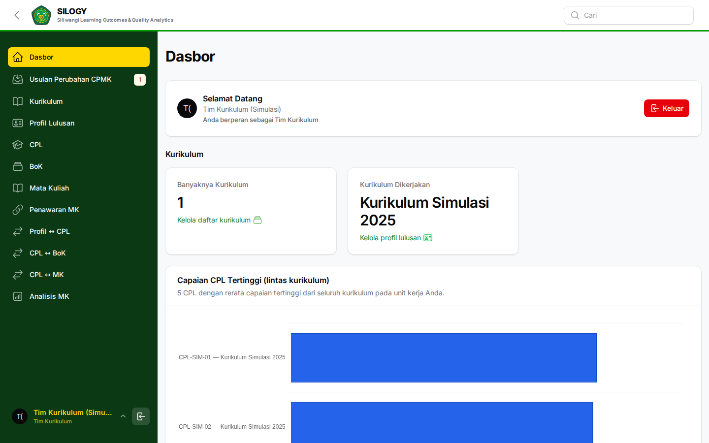

## Pilih kurikulum dulu

Cara masuk dan pilih peran ada di [indeks panduan](00-README.md).

1. Di dasbor atau menu **Kurikulum**, klik kurikulum yang akan diisi. Pilihan tersimpan di sesi: semua menu Profil, CPL, BoK, MK, dan matriks mengikuti kurikulum itu.

   

2. Banner di atas halaman menampilkan kurikulum terpilih.

   

Tanpa kurikulum terpilih, daftar CPL/MK bisa kosong meski datanya ada di kurikulum lain.

## Urutan OBE yang wajib

Profil → CPL → BoK → MK → (lalu Koordinator: CPMK → Asesmen → Dosen: Nilai).

Jangan menulis MK sebelum CPL ada. Jangan menawar MK di prodi sebelum MK induk (universitas/fakultas) selesai bila mata kuliah itu milik unit atas.

## 1. Kurikulum

1. Buka **Kurikulum** → buat.

   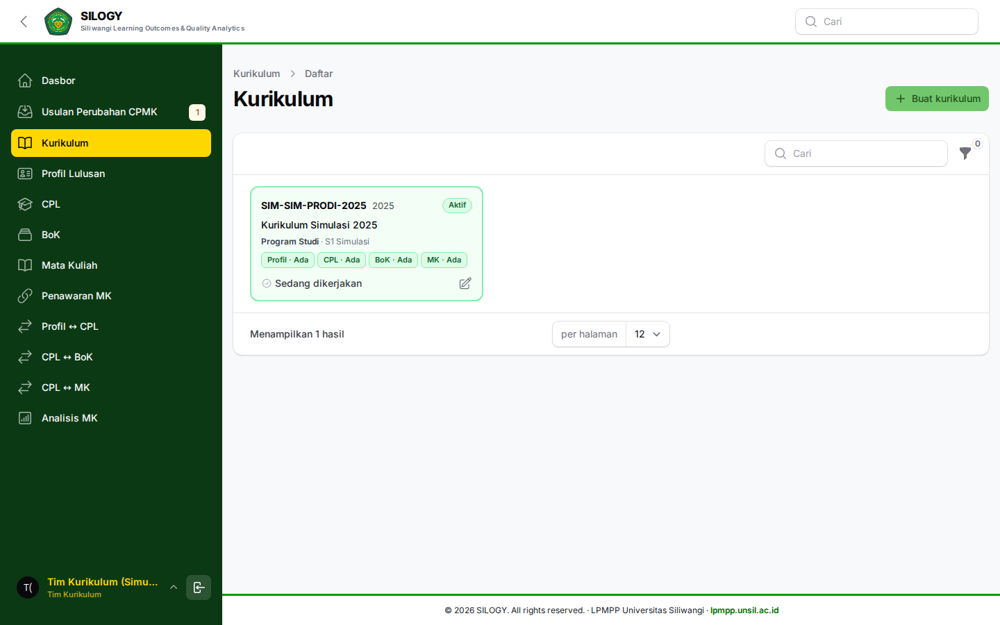

2. Isi **Unit akademik** (terkunci bila hanya satu unit), **Nama**, **Kode** (contoh `KUR-2025-PMAT`), **Tahun**.

   

3. Geser **Target capaian lulusan (%)** — acuan dasbor pimpinan. Default 75.

   

4. Isi deskripsi bila perlu. Nyalakan **Kurikulum aktif** hanya untuk yang sedang dipakai.

   

5. Simpan. Klik kartu kurikulum itu agar menjadi kurikulum terpilih.

   

Status di kartu (Draft → Profil → CPL → BoK → MK → Set dosen → Aktif) menandai kelengkapan. Isi datanya; status mengikuti.

## 2. Profil Lulusan (hanya prodi)

Menu hilang jika kurikulum terpilih bukan prodi, atau status tim kurikulum Anda di fakultas/universitas.

1. Buka **Profil Lulusan** → buat.

   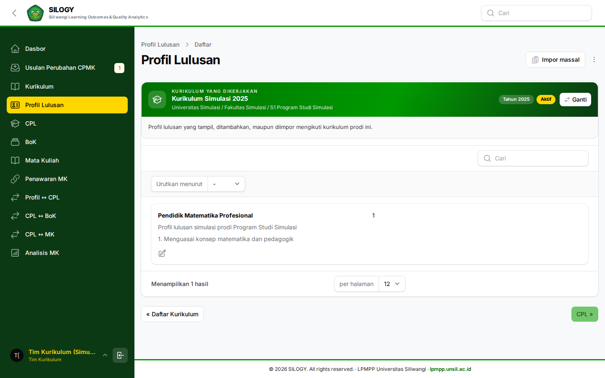

2. Isi **Kode**, **Nama**, **Urutan**, dan **Deskripsi** (wajib).

   

3. Tambah **indikator** pada repeater.

   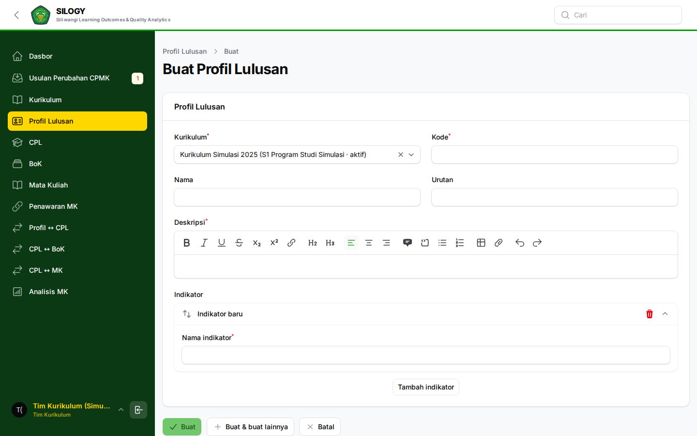

4. Ulangi untuk setiap profil.

   

## 3. CPL

1. Buka **CPL** → buat. Isi kode unik per kurikulum, deskripsi, dan **Domain** (boleh lebih dari satu: kognitif, afektif, psikomotorik).

   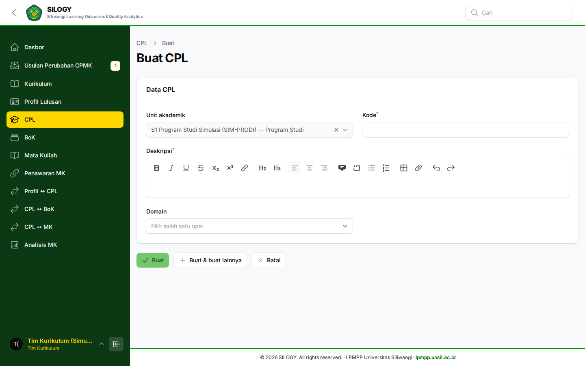

2. CPL milik unit induk bisa tampil di prodi sebagai adaptasi. Rumusan asli tidak diubah — hanya **Kode (alias di unit ini)**.

   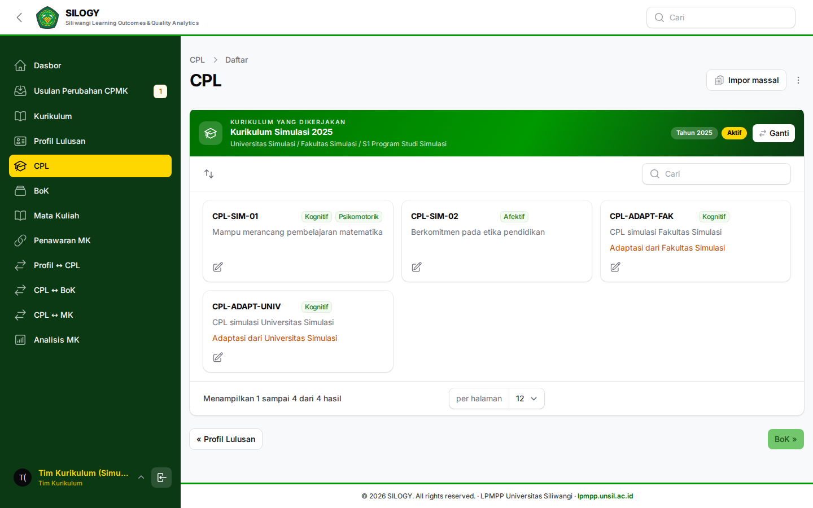

3. Petakan ke profil di matriks **Profil ↔ CPL**.

   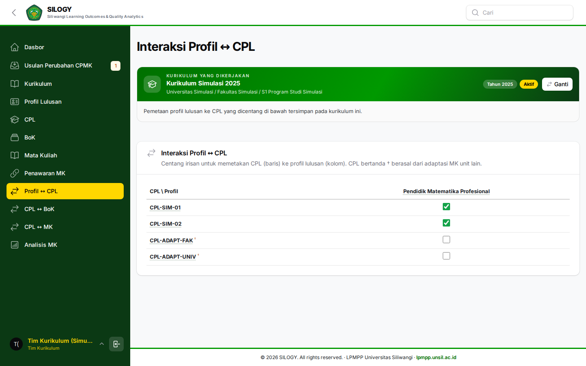

## 4. BoK

1. Buka **BoK** → buat. Isi kode dan rumusan bahan kajian.

   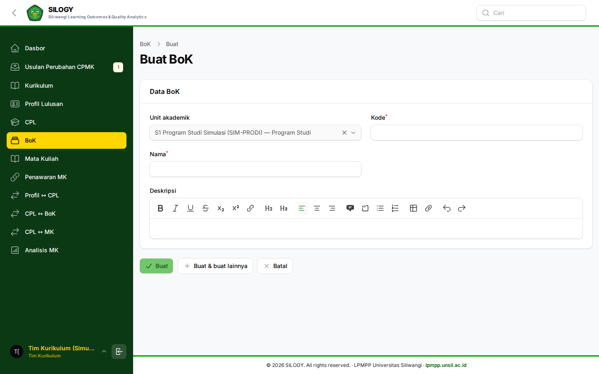

2. BoK unit induk bisa diadaptasi; rumusan asli tidak diubah di prodi.

   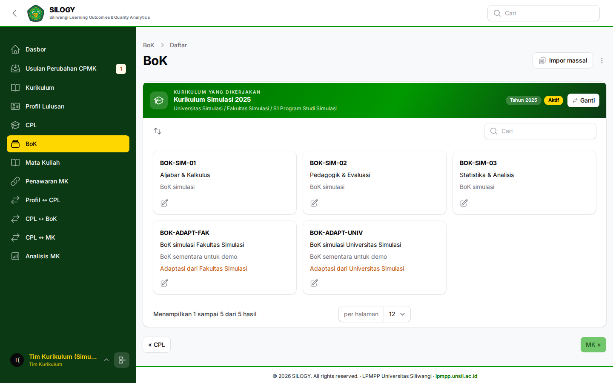

3. Petakan ke CPL di **CPL ↔ BoK**.

   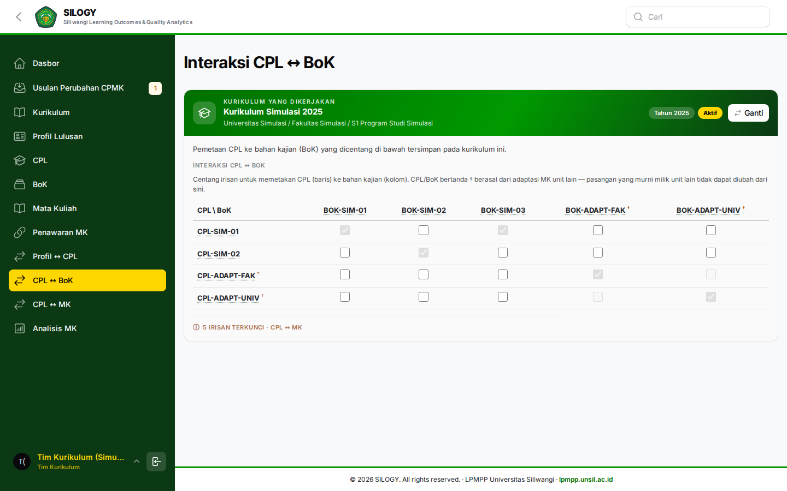

## 5. Mata kuliah

1. Buka **MK** → buat. Isi **Unit pemilik**, **Nama**, SKS teori/praktik/lapangan (total terhitung sendiri), **Jenis** (wajib/pilihan), status aktif.

   

2. Isi **Koordinator MK** dari daftar dosen. Pilihan ini memberi role Koordinator Mata Kuliah — tanpa ini koordinator tidak punya menu CPMK untuk MK tersebut.

   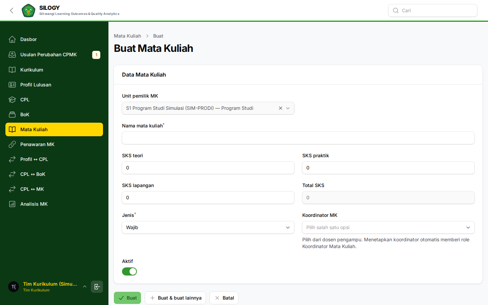

3. Kode MK di prodi diisi di Penawaran MK, bukan di form ini.

   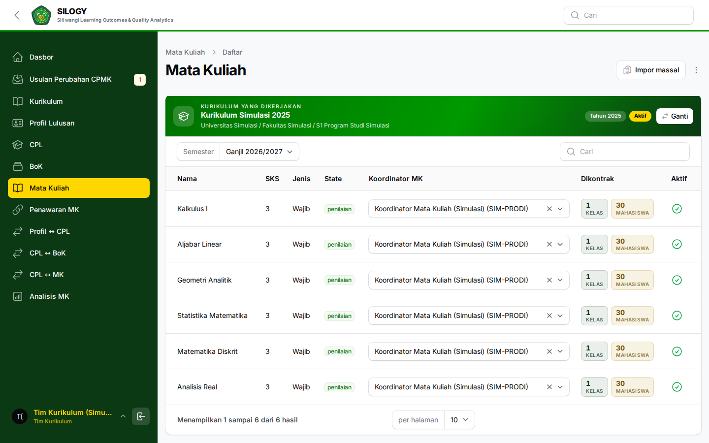

MK penciri universitas/fakultas dibuat oleh Tim Kurikulum unit pemiliknya. Prodi hanya menawarkannya.

## 6. Penawaran MK (hanya prodi)

1. Buka **Penawaran MK** → buat.

   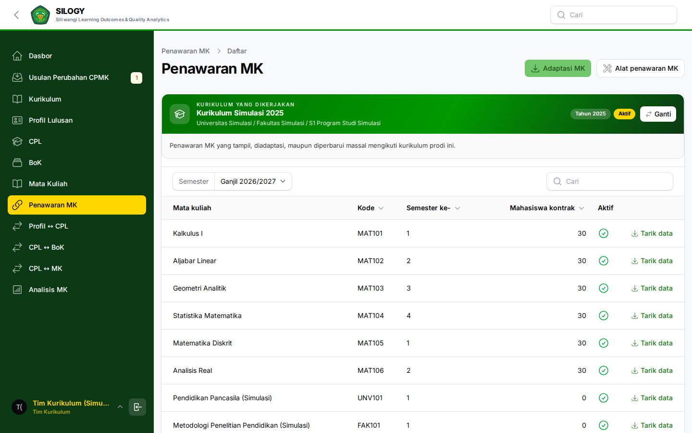

2. Pilih MK milik prodi atau MK unit induk. Isi **Kode MK di unit** (unik per kurikulum) dan **Semester ke-** (1–14).

   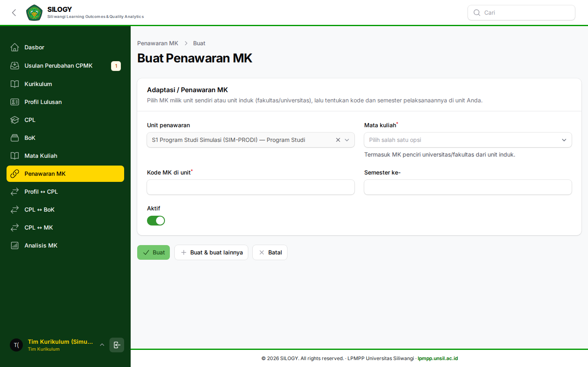

3. Satu MK hanya sekali per kurikulum.

   

## 7. Matriks pemetaan

Kerjakan berurutan. Kotak tercentang = ada pemetaan.

1. **Profil ↔ CPL** (prodi) — setiap profil dan setiap CPL saling menyentuh minimal sekali.

   

2. **CPL ↔ BoK** — setiap BoK menopang minimal satu CPL.

   

3. **CPL ↔ MK** — setiap MK yang ditawarkan mengukur minimal satu CPL. Tanpa ini laporan capaian MK kosong.

   

Jangan mencentang semua kotak; hanya yang memang diukur.

## 8. Kelas MK

Anda punya wewenang kelas di unit prodi. Biasanya Admin Prodi yang membuat rombongan, pengampu, dan peserta.

1. Pastikan **Semester** aktif sudah benar (Super Admin).

   

2. Buka **Kelas MK** → buat. Pilih MK yang sudah ditawarkan, semester, dan pengampu.

   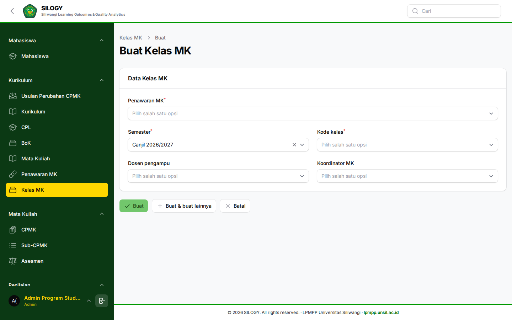

## 9. Analisis MK

Menu paling bawah. Ringkasan capaian setelah nilai masuk — bukan tempat menulis rumusan. Jika grafik kosong: cek pemetaan CPL, asesmen 100%, dan nilai tersimpan.

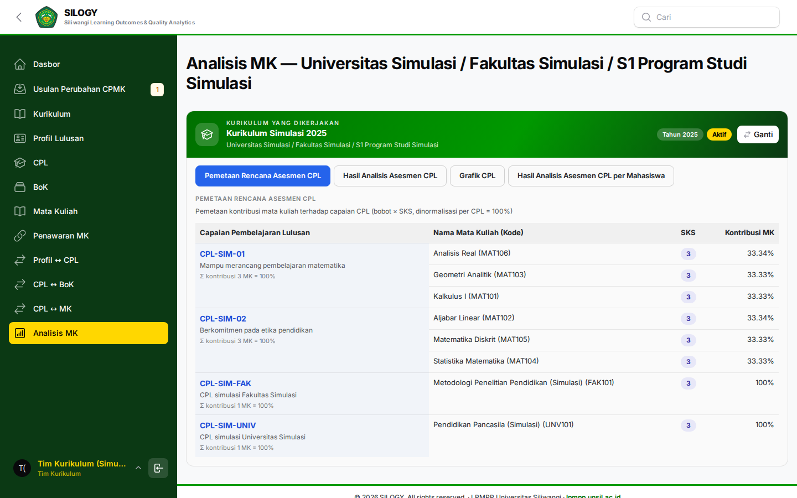

## Kotak masuk usulan CPMK

Koordinator boleh **memakai ulang** CPMK semester lalu tanpa izin. **Mengubah** CPMK yang sudah berjalan di suatu semester harus lewat Anda, karena CPMK terikat ke CPL.

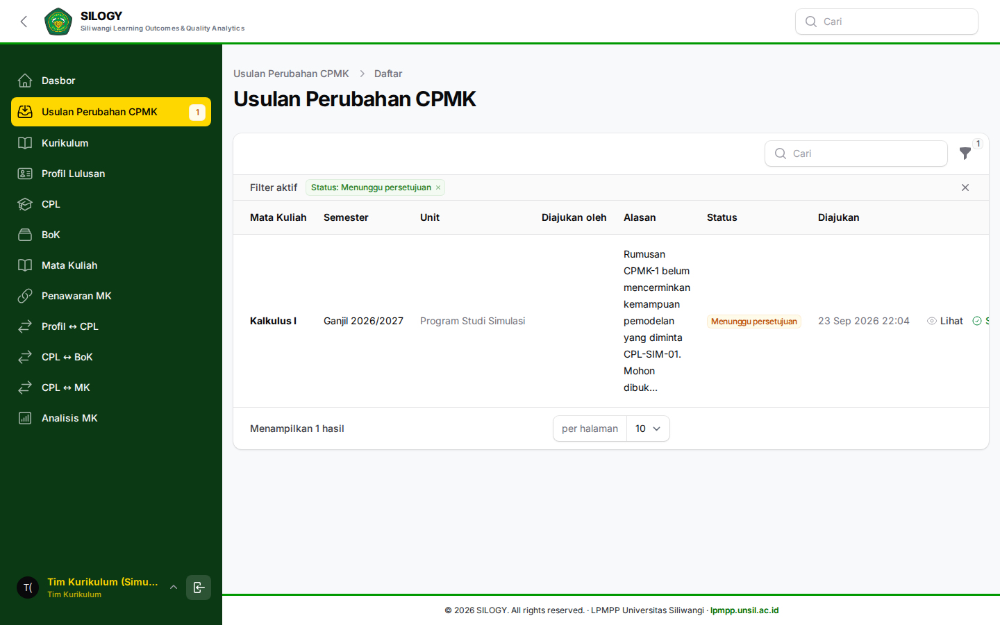

1. Buka **Usulan Perubahan CPMK**. Baca alasan dan potret CPMK saat diajukan.

   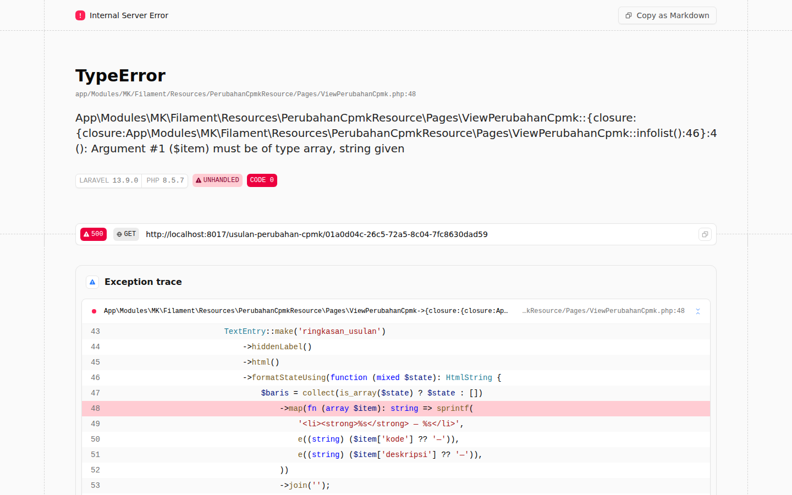

2. **Setujui** jika wajar — koordinator boleh menyusun ulang.

   

3. **Tolak** hanya dengan alasan tertulis.

   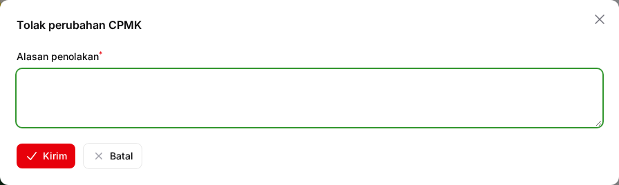

Anda tidak bisa menyetujui usulan yang Anda ajukan sendiri. Satu usulan terbuka per mata kuliah per semester. Tim Kurikulum fakultas/universitas melihat usulan MK di unit anak.

## Impor massal

Di daftar Profil, CPL, BoK, dan MK biasanya ada **Impor massal**. Unduh templat, isi tanpa mengubah nama kolom, unggah, perbaiki baris yang ditolak. Impor terikat kurikulum terpilih.

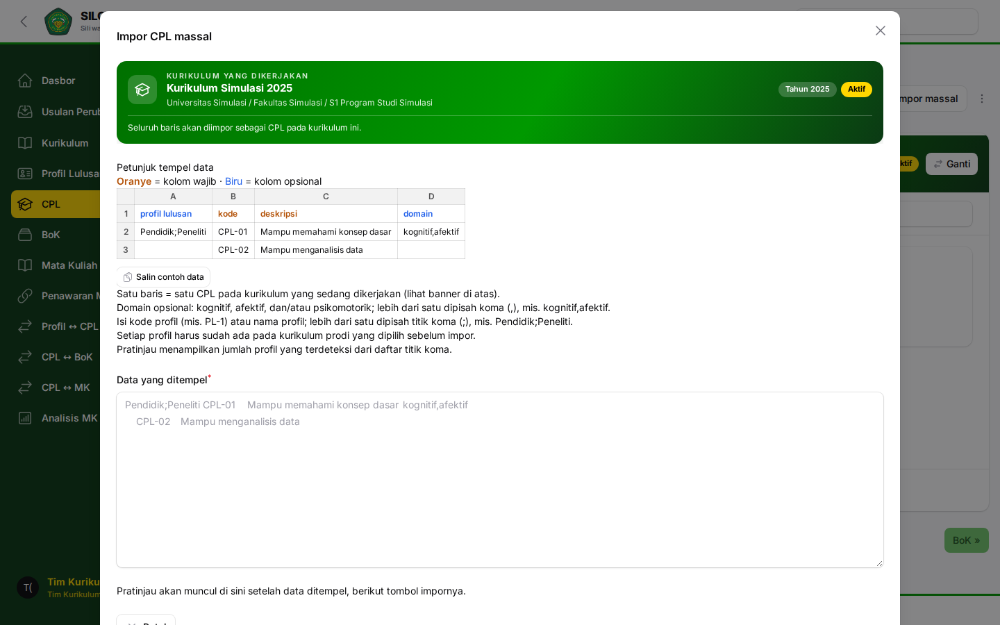

## Jika menu kosong atau tombol hilang

| Gejala | Penyebab lazim | Yang dilakukan |
|--------|----------------|----------------|
| Profil Lulusan / Penawaran MK tidak ada | Kurikulum terpilih bukan prodi, atau status tim kurikulum di fakultas | Pilih kurikulum prodi, atau minta Admin mengaktifkan status di prodi |
| Daftar CPL/MK kosong | Belum memilih kurikulum | Klik kurikulum yang benar |
| Koordinator tidak bisa buka CPMK | Kolom Koordinator MK kosong | Isi Koordinator MK di form MK |
| Matriks CPL↔MK kosong | MK belum ditawarkan di prodi | Isi Penawaran MK |
| Usulan tidak bisa disetujui | Anda pengusulnya, atau sudah diputus | Minta anggota tim lain meninjau |

## Bukan tugas Anda

Sub-CPMK, asesmen (bobot komponen), dan nilai mahasiswa. Itu Koordinator MK dan Dosen Pengampu.
