# Panduan Koordinator Mata Kuliah

Cara masuk: [indeks panduan](00-README.md). Buku ini dimulai setelah kartu **Koordinator MK** aktif.

Koordinator Mata Kuliah menurunkan CPL menjadi **CPMK**, **Sub-CPMK**, dan **Asesmen** yang bisa dinilai. Ketiganya berlaku **per semester** untuk setiap MK yang Anda koordinasikan. Dosen hanya mengisi angka.

## Siapa Anda

Anda ditetapkan sebagai **Koordinator MK** pada form Mata Kuliah oleh Tim Kurikulum. Tanpa itu, daftar MK Anda kosong. Satu orang boleh mengoordinasikan beberapa MK; kerjakan satu MK pada satu waktu.

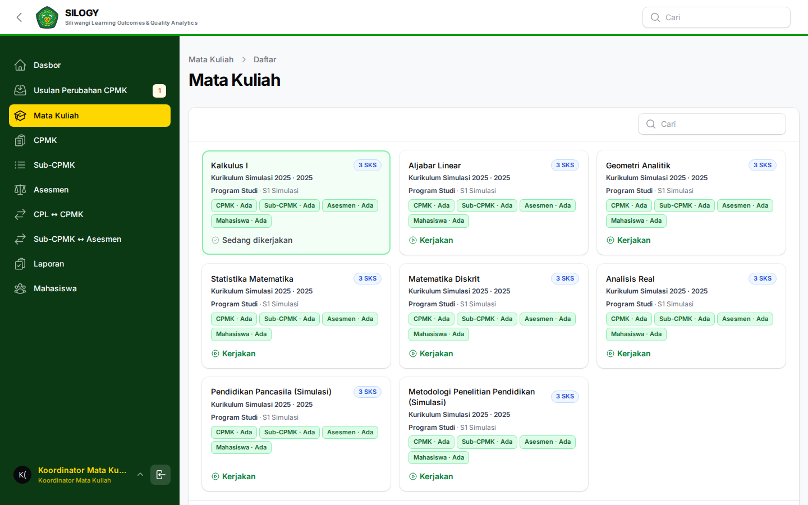

Role ini bukan dosen pengampu. Nilai diisi di akun Dosen. Jika merangkap, pilih kartu peran yang sesuai.

## Menu yang tampil

Sidebar rata: Dasbor, Mata Kuliah, CPMK, Sub-CPMK, Asesmen, CPL ↔ CPMK, Sub-CPMK ↔ Asesmen, Laporan, Mahasiswa.

Menu CPMK dan seterusnya baru lengkap setelah MK terpilih.

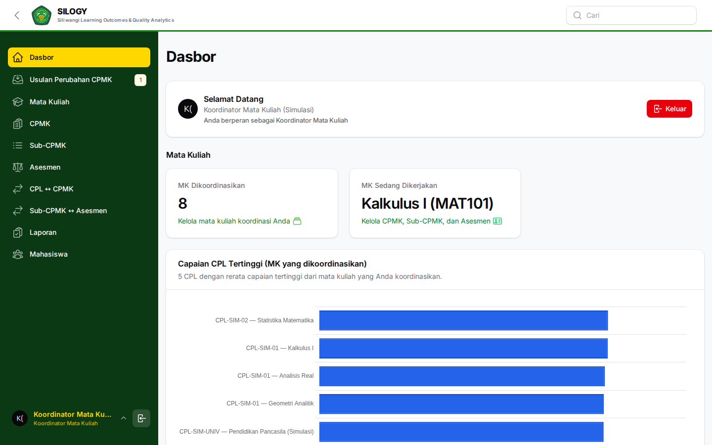

## Langkah 0: pilih MK dan semester

Cara masuk dan pilih peran ada di [indeks panduan](00-README.md).

1. Buka **Mata Kuliah**. Klik MK. Banner menandai MK terpilih — semua menu berikutnya merujuk ke situ.

   

   

2. Di halaman CPMK / Sub-CPMK / Asesmen, pilih **semester**. Data terikat semester ini.

   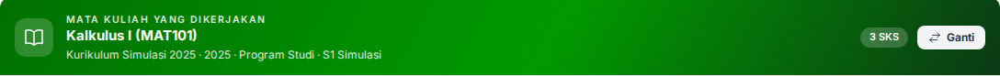

Jika daftar MK kosong: hubungi Tim Kurikulum agar nama Anda diisi pada kolom Koordinator MK.

## Pakai ulang atau susun baru

Setiap awal semester, data bisa masih kosong.

| Jalan | Kapan | Akibat |
|-------|--------|--------|
| **Gunakan data semester lain** | Rumusan semester lalu masih pas | Bukan salinan. Data yang sama dipakai lagi. Menyuntingnya mengubah semester lain yang memakainya, termasuk yang nilainya sudah final. |
| **Susun baru** (buat / impor) | Rumusan harus beda, atau Anda tidak ingin menempel data lama | Data baru, aman disunting tanpa menggeser semester lalu. |

Di modal pakai ulang: pilih *sepaket* (semua baris) atau *sebagian* (centang sendiri). Yang bertanda **Harus baru** tidak bisa dicentang.

## 1. CPMK

1. Buka **CPMK**, pastikan MK dan semester benar.

   

2. Jika rumusan lalu masih sesuai: **Gunakan data semester lain**.

3. Jika semester ini masih kosong dan perlu rumusan baru: buat satu per satu atau **Impor massal**. Isi kode, rumusan, kaitkan ke CPL.

   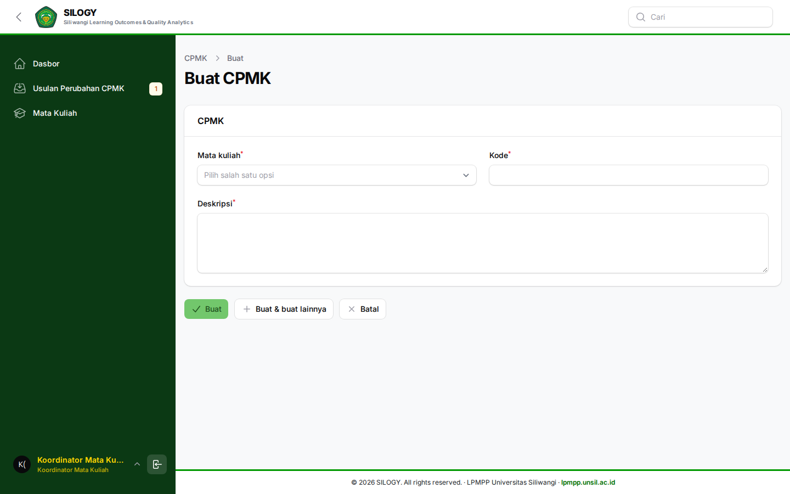

4. Jika semester ini **sudah punya CPMK** dan rumusan harus diubah: jangan sunting diam-diam. Ajukan perubahan (bagian berikutnya).

Setiap CPMK harus terkait minimal satu CPL.

## Ajukan perubahan CPMK

Tombol **Ajukan perubahan CPMK** muncul justru ketika data *tidak boleh* diubah: semester ini sudah jalan dan belum ada izin Tim Kurikulum. Memakai ulang CPMK lama tidak lewat tombol ini.

1. Isi **Alasan perubahan** (wajib).

2. Kirim. Pantau di **Usulan Perubahan CPMK** (Anda hanya melihat usulan sendiri).

   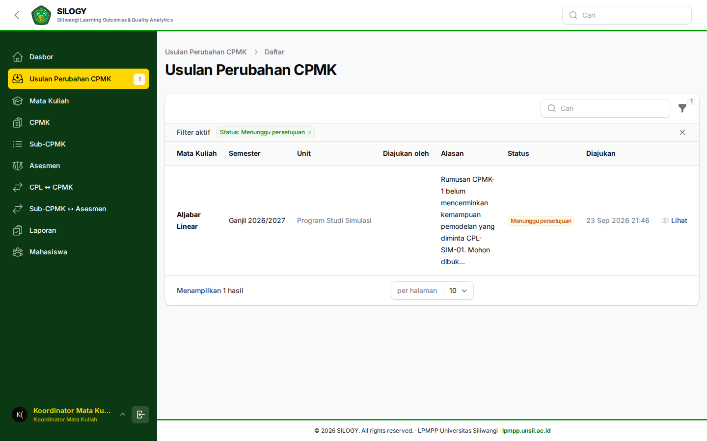

3. Selama **Diajukan**, CPMK terkunci. Setelah **Disetujui**, susun ulang. Jika **Ditolak**, baca alasan lalu ajukan lagi.

Satu usulan terbuka per MK per semester.

## 2. Sub-CPMK

1. Buka **Sub-CPMK**.

   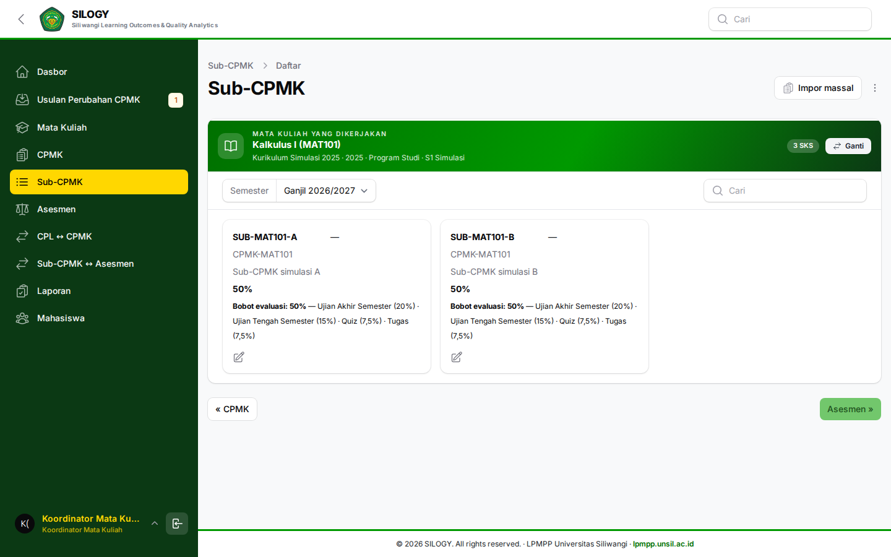

2. Pakai ulang Sub-CPMK lama **hanya untuk CPMK yang juga dipakai ulang**. Sub-CPMK milik CPMK baru bertanda **Harus baru**.

3. Form: pilih CPMK induk, kode, deskripsi (wajib), indikator, cara evaluasi. Bobot dihitung dari asesmen, bukan diketik di sini.

   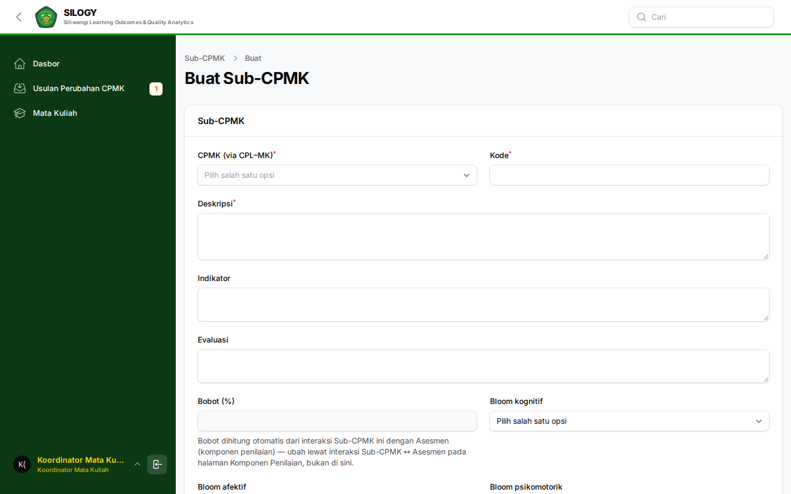

Sub-CPMK harus operasional (bisa diamati di tugas/ujian).

## 3. Asesmen

Asesmen berlaku untuk **semua kelas** MK itu pada semester terpilih.

1. Buka **Asesmen**.

   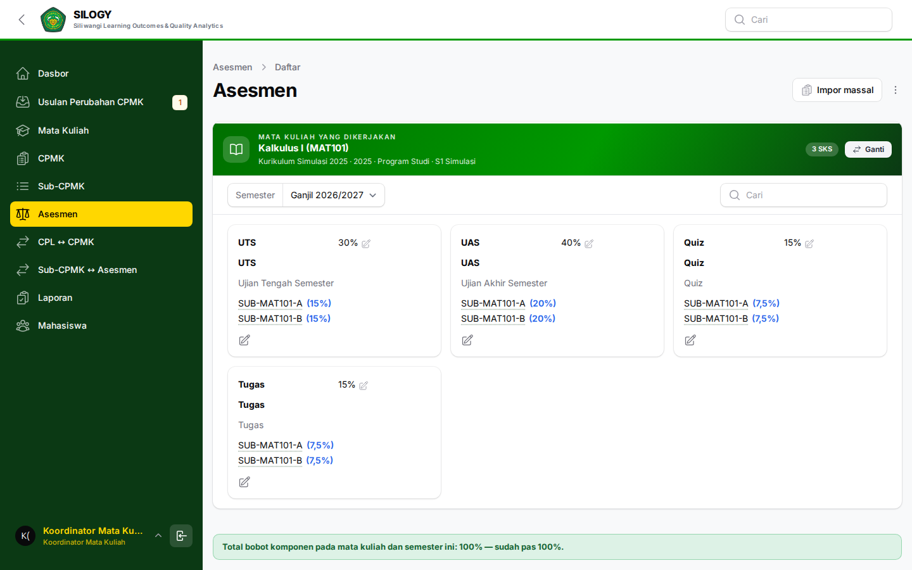

2. Pakai ulang asesmen lama hanya jika seluruh Sub-CPMK yang diukurnya sudah berlaku di semester ini. Jika kurang, baris bertanda **Harus baru**.

3. Untuk yang baru: kode, nama, **Jenis evaluasi**, **Bobot (%)**, kaitkan ke Sub-CPMK.

   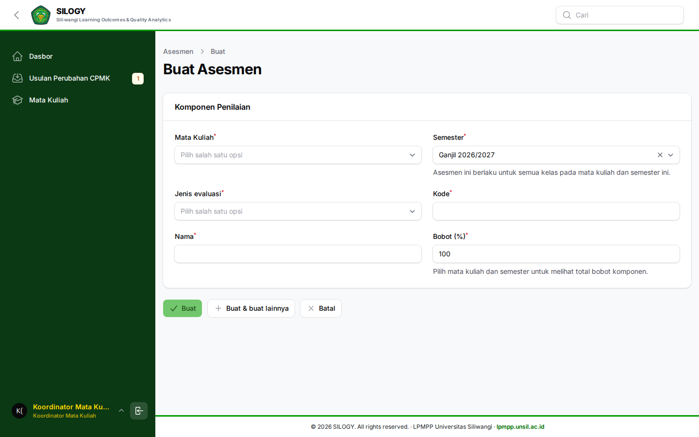

4. Total bobot harus **tepat 100%**. Kurang atau lebih: dosen tidak bisa mengisi nilai.

   

Komponen yang dipakai lebih dari satu semester menampilkan peringatan kuning. Menyuntingnya mengubah semua semester itu.

## 4. Matriks

1. **CPL ↔ CPMK** — setiap CPMK menyentuh CPL yang dijanjikan Tim Kurikulum pada MK ini.

   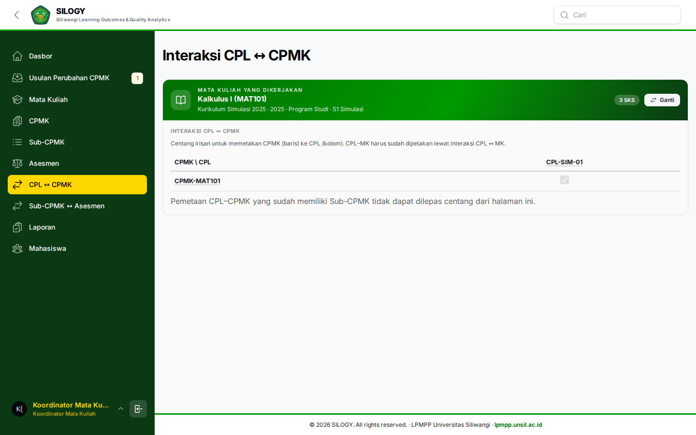

2. **Sub-CPMK ↔ Asesmen** — setiap komponen menilai minimal satu Sub-CPMK; setiap Sub-CPMK diukur minimal satu komponen.

   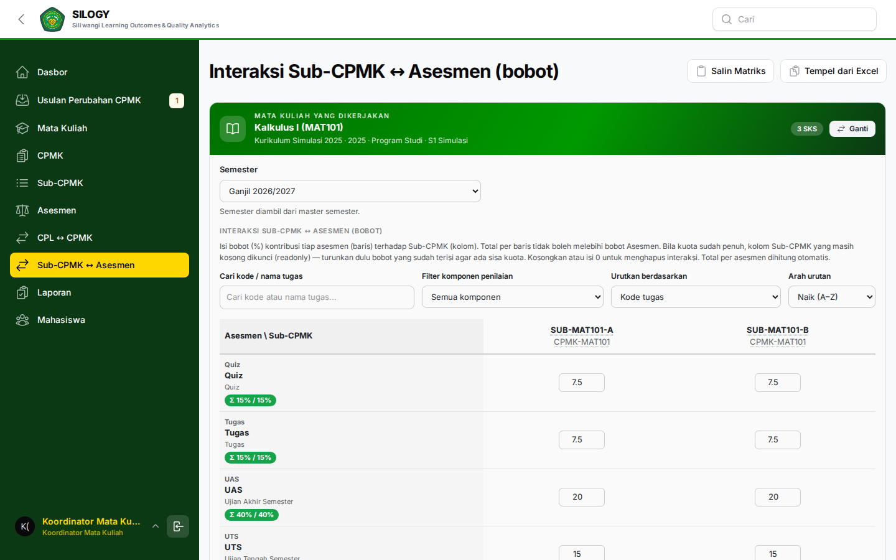

## 5. Mahasiswa (peserta)

Menu **Mahasiswa** adalah peserta kelas, bukan master mahasiswa. Rombongan dan pengampu biasanya Admin Prodi. Nilai diisi Dosen di Input Nilai.

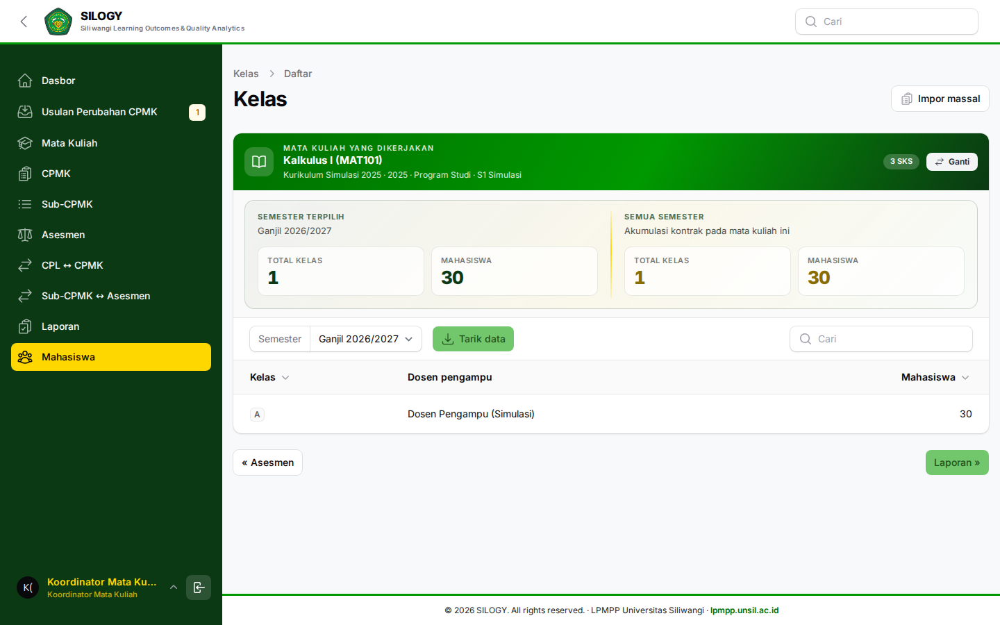

## 6. Laporan

Menu **Laporan** menampilkan portofolio, evaluasi CPL, analisis per mahasiswa, dan laporan lengkap untuk **semua kelas** MK yang Anda koordinasikan (bukan hanya kelas yang Anda ampu sebagai dosen).

1. Pilih semester dan kelas bila diminta.

2. Pakai angka ini untuk rapat MK, bukan untuk mengubah rumusan diam-diam.

Jika kosong: asesmen belum 100%, nilai belum disimpan, atau pemetaan CPL–CPMK putus.

## Reset satu semester

Tombol **Reset** hanya melepas data dari **semester yang sedang dipilih**. Data yang masih dipakai semester lain tetap utuh. Yang tidak dipakai semester mana pun baru benar-benar terhapus.

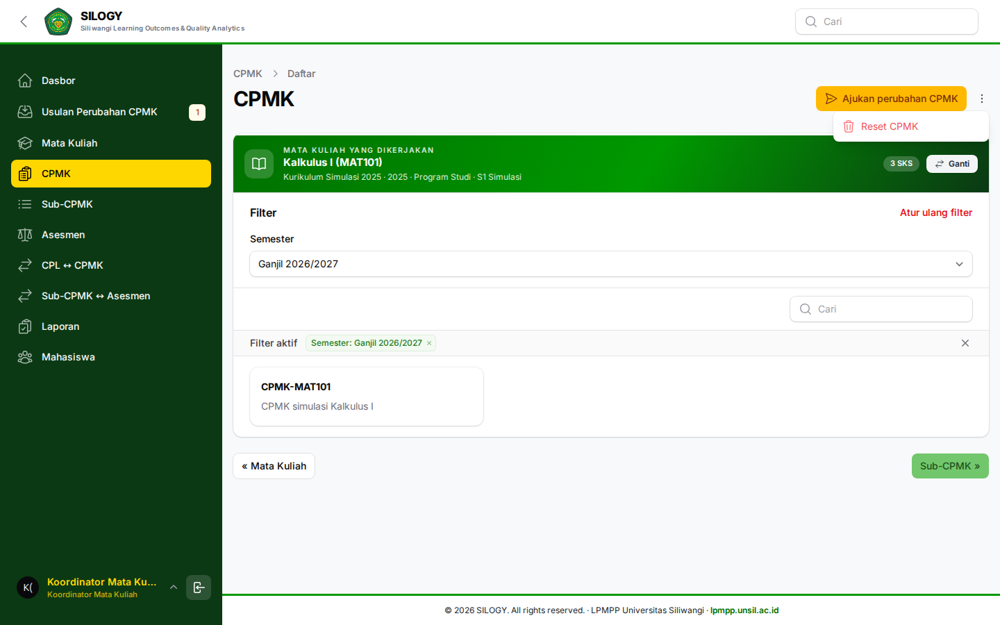

Jangan dipegang jika nilai semester itu sudah final, kecuali Tim Kurikulum meminta penyusunan ulang setelah usulan disetujui.

## Jika halaman kosong, terkunci, atau 403

| Gejala | Penyebab lazim | Yang dilakukan |
|--------|----------------|----------------|
| 403 / akses ditolak di CPMK | MK belum dipilih, atau Anda bukan koordinator MK itu | Kembali ke Mata Kuliah; minta Tim Kurikulum mengisi koordinator |
| Tombol buat hilang / form terkunci | Semester sudah punya CPMK tanpa izin ubah, atau usulan masih Diajukan | Ajukan perubahan atau tunggu keputusan |
| Pakai ulang: baris Harus baru | Induknya (CPMK / Sub-CPMK) belum berlaku di semester ini | Pakai ulang / susun induknya dulu |
| Dosen tidak bisa Input Nilai | Total asesmen bukan 100%, atau dosen belum pengampu | Perbaiki bobot; minta Admin Prodi menugaskan pengampu |
| Laporan kosong | Nilai belum lengkap atau pemetaan putus | Cek matriks dan simpan nilai di akun dosen |

## Bukan tugas Anda

Menulis Profil / CPL / BoK / MK (Tim Kurikulum) dan mengisi nilai mahasiswa (Dosen Pengampu).

**Memakai ulang CPMK lama tidak perlu izin. Mengubah CPMK yang sudah jalan perlu izin Tim Kurikulum.**
