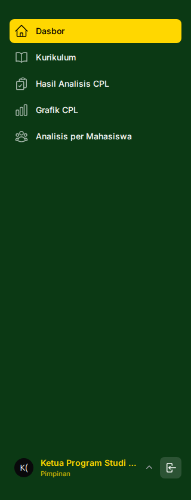
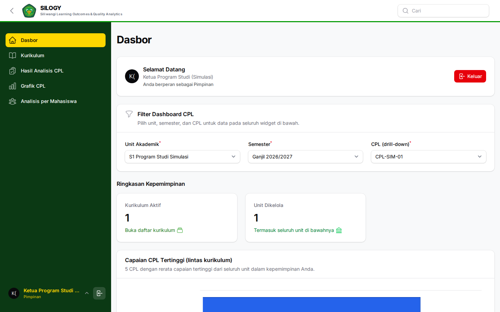
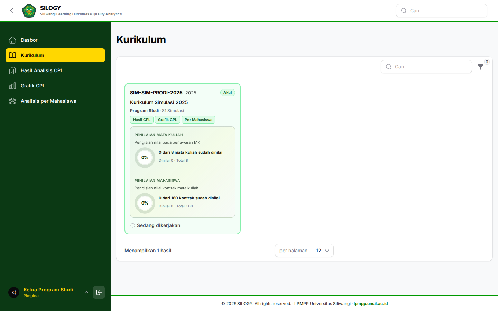
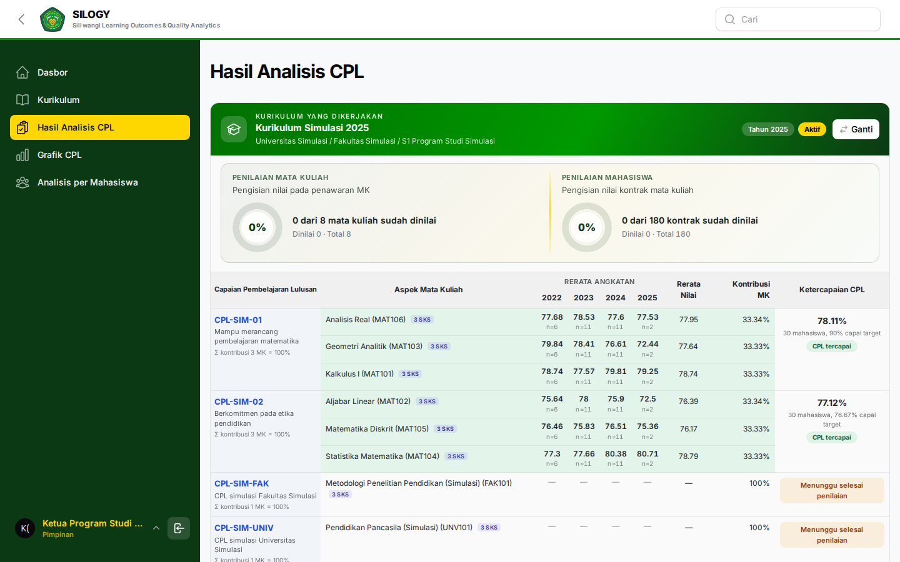
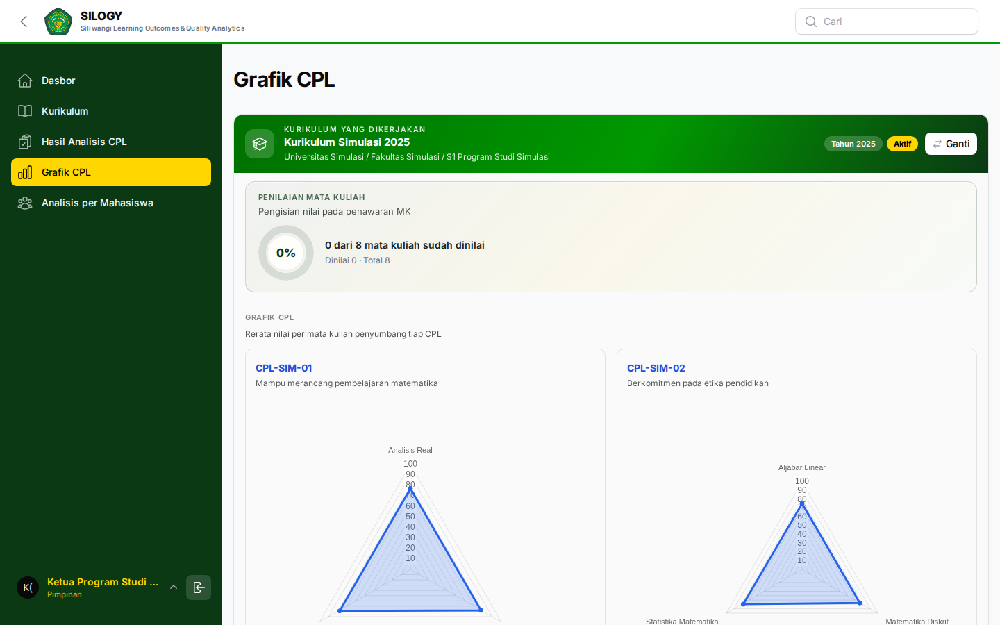
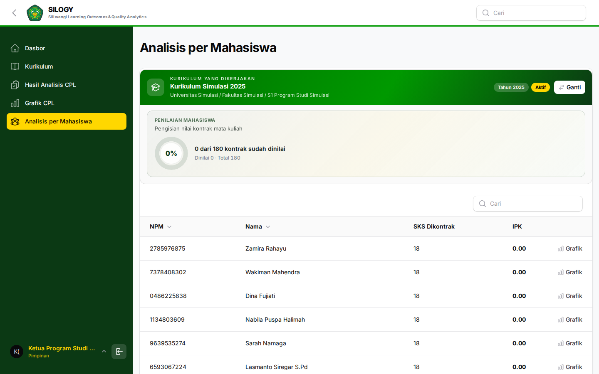

# Panduan Pimpinan

Alamat SILOGY: **https://silogy.unsil.ac.id/login**

Pimpinan memantau capaian pada cakupan unitnya dan dapat meminta analisis berbasis AI untuk pengambilan keputusan. Peran ini **tidak menginput data**: seluruh angka yang Anda lihat berasal dari nilai yang diisi Dosen Pengampu di atas struktur yang disusun Tim Kurikulum dan Koordinator MK.

Keempat tingkat pimpinan — Universitas, Fakultas, Jurusan, Program Studi — memiliki kewenangan yang sama, berbeda hanya pada **cakupan unit**.

## Kewenangan utama
- Melihat **Laporan** dan **Dashboard**.
- **Ekspor data**.
- **Minta Analisis AI**.

## Menu yang tersedia
- **Dashboard / Laporan**: ringkasan ketercapaian CPL/CPMK pada unit.
- **AI Analisis → Minta Analisis**: ajukan analisis baru.
- **AI Analisis → Riwayat Analisis**: lihat hasil analisis sebelumnya.

## Tugas yang sering dilakukan

### 1. Memantau capaian
1. Buka **Dashboard** untuk ringkasan ketercapaian pembelajaran di unit Anda.
2. Telusuri laporan per prodi/MK/CPL sesuai kebutuhan.

### 2. Meminta analisis AI
1. Buka **AI Analisis → Minta Analisis**.
2. Pilih lingkup (unit/semester/mata kuliah) yang ingin dianalisis.
3. Kirim permintaan. Proses berjalan di latar belakang.
4. Buka **Riwayat Analisis** untuk melihat hasil setelah selesai.

### 3. Ekspor data
- Gunakan tombol **Ekspor** pada laporan untuk mengunduh data sebagai bahan rapat/akreditasi.

## Praktik baik
- Gunakan analisis AI sebagai pendukung keputusan, bukan satu-satunya dasar; verifikasi dengan data laporan.
- Pastikan semester yang ditinjau sudah memiliki nilai yang lengkap agar analisis akurat.

## Catatan umum

Role pada panduan ini tidak melakukan input data kurikulum maupun nilai. Bila menemukan kekeliruan data, koordinasikan dengan role pelaksana terkait (Tim Kurikulum, Koordinator MK, Dosen, atau Admin Unit).
