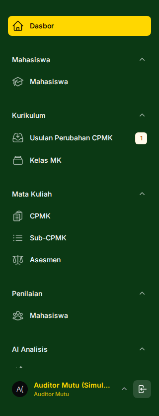
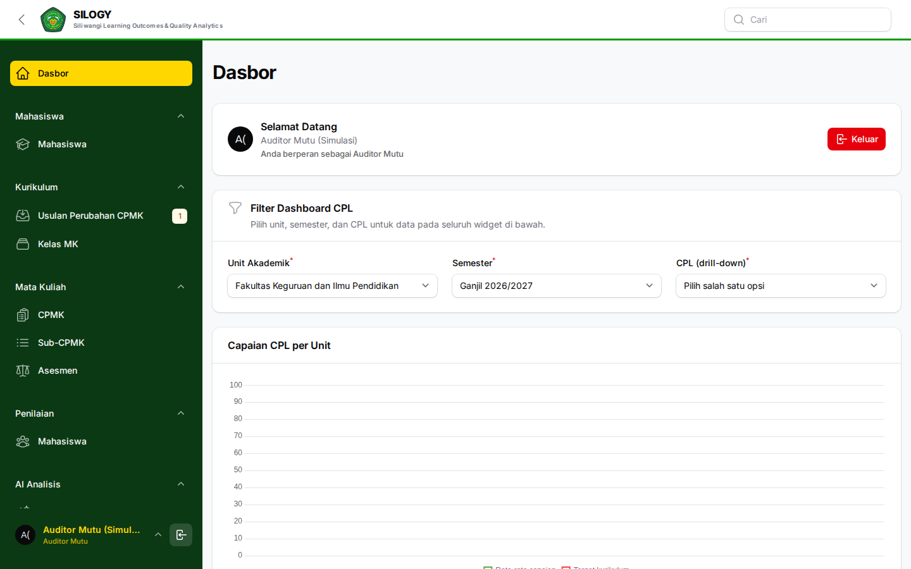
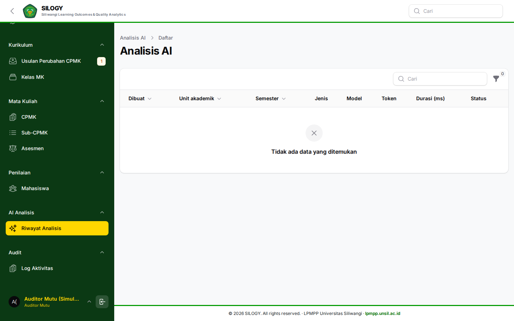

# Panduan Auditor Mutu

Alamat SILOGY: **https://silogy.unsil.ac.id/login**

Auditor Mutu menjamin kualitas dan kepatuhan proses melalui laporan dan jejak audit. Peran ini bersifat **hanya membaca** — Anda dapat menelusuri seluruh perubahan data, tetapi tidak mengubah apa pun.

## Kewenangan utama
- Melihat **Laporan** dan **Dashboard**.
- **Ekspor data**.
- Melihat **Log Audit**.

## Menu yang tersedia
- **Dashboard / Laporan**.
- **Audit → Log Aktivitas**.

## Tugas yang sering dilakukan

### 1. Menelaah laporan capaian
- Buka **Dashboard/Laporan** untuk meninjau ketercapaian CPL/CPMK dan kelengkapan data.

### 2. Memeriksa jejak audit
1. Buka **Audit → Log Aktivitas**.
2. Gunakan filter (pengguna, tanggal, jenis aktivitas) untuk menelusuri perubahan data.
3. Catat temuan ketidaksesuaian.

Riwayat analisis AI juga dapat ditelaah sebagai bagian dari bukti audit.

### 3. Ekspor untuk dokumentasi audit
- Ekspor laporan dan log sebagai bukti audit/akreditasi.

## Praktik baik
- Lakukan penelaahan berkala mengikuti siklus audit mutu internal.
- Bandingkan jejak audit dengan kebijakan/SOP untuk mendeteksi penyimpangan.
- Auditor tidak mengubah data; sampaikan temuan ke Admin/Pimpinan terkait untuk tindak lanjut.

## Catatan umum

Role pada panduan ini tidak melakukan input data kurikulum maupun nilai. Bila menemukan kekeliruan data, koordinasikan dengan role pelaksana terkait (Tim Kurikulum, Koordinator MK, Dosen, atau Admin Unit).
