# Simulasi Penggunaan SILOGY (Urutan End-to-End)

Dokumen ini menyajikan **alur simulasi berurutan** penggunaan sistem SILOGY dari nol hingga menghasilkan laporan dan analisis. Setiap tahap menyebutkan **role pelaksana**, **menu**, dan **langkah**. Ikuti urutannya karena setiap tahap menjadi prasyarat tahap berikutnya.

Alamat resmi: **https://silogy.unsil.ac.id/login**

> Akun contoh (hasil seeding) — password awal `siliwangi`:
> `superadmin`, `adminuniv`, `adminfak`, `adminjur`, `adminprodi`, `timkur`, `korma`, `dosen`, `kaprodi`, `dekan`, `rektor`, `auditor`.

---

## Peta alur singkat

```
Super Admin            Admin Unit         Tim Kurikulum        Koordinator MK        Dosen           Pimpinan/Auditor
─────────────          ──────────         ──────────────       ──────────────        ─────           ────────────────
Institusi & Akun  →    User & Kelas  →    CPL→BoK→MK      →     CPMK→SubCPMK→     →   Input Nilai →   Laporan, Analisis AI,
Semester aktif         Set dosen MK       Profil Lulusan       Komponen Nilai        Import Nilai     Audit
```

---

## TAHAP 0 — Persiapan sistem (Super Admin)

**Login sebagai `superadmin`.**

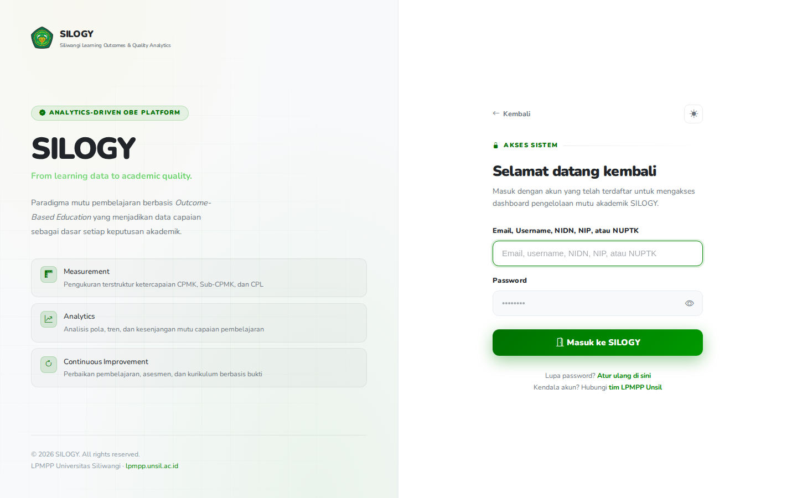

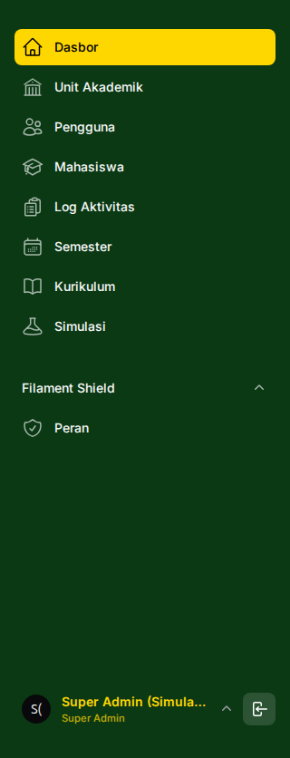

1. **Institusi → Unit Akademik**: buat hirarki
   - Buat Universitas (tipe *university*).
   - Buat Fakultas (induk: Universitas).
   - Buat Jurusan (induk: Fakultas).
   - Buat Program Studi (induk: Jurusan).
2. **Semester**: buat dan **aktifkan** semester berjalan (mis. Ganjil 2026/2027).
3. **Autentikasi → Roles**: pastikan seluruh role tersedia dan permission-nya sesuai (hasil seeding sudah menyiapkan ini).
4. (Opsional) **Autentikasi → Users**: buat akun admin tiap unit bila belum ada.

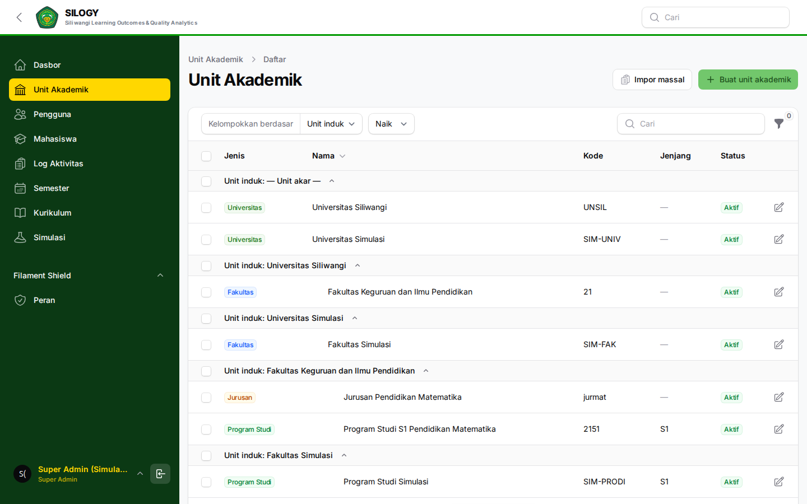

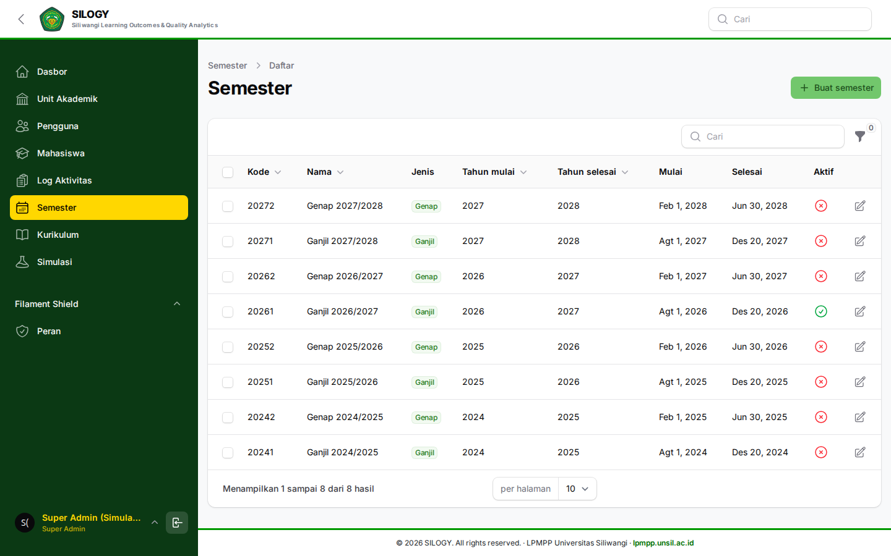

✅ *Output tahap ini:* struktur institusi lengkap + semester aktif.

---

## TAHAP 1 — Penyiapan akun & operasional unit (Admin Unit)

**Login sebagai `adminprodi` (atau admin unit terkait).**

1. **Autentikasi → Users**: buat akun untuk:
   - Anggota **Tim Kurikulum** (tetapkan unit = prodi, status tim kurikulum aktif).
   - **Koordinator Mata Kuliah**.
   - **Dosen Pengampu**.
2. **Mahasiswa**: input/import data mahasiswa prodi.
3. *(Kelas dibuat setelah MK tersedia — lihat Tahap 3.)*

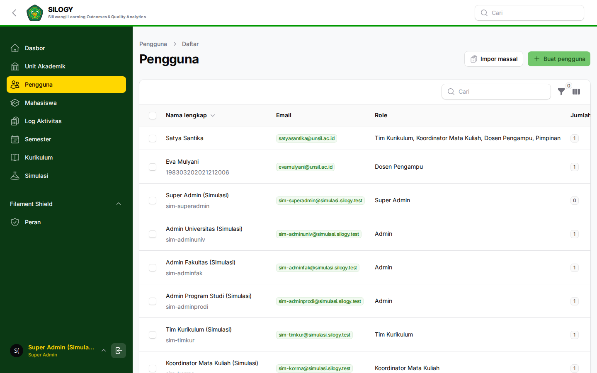

✅ *Output:* akun pelaku akademik & data mahasiswa siap.

---

## TAHAP 2 — Penyusunan kurikulum (Tim Kurikulum)

**Login sebagai `timkur`.**

1. **Kurikulum**: buat kurikulum (nama, tahun berlaku, prodi).
2. **Profil Lulusan**: tambahkan profil lulusan prodi.
3. **CPL**: rumuskan CPL, kaitkan ke profil lulusan.
4. **BoK**: tambahkan bahan kajian, kaitkan ke CPL.
5. **MK**: tambahkan mata kuliah (kode, nama, SKS).
6. **MK Unit**: tempatkan MK pada prodi & semester; petakan MK ke CPL/BoK.

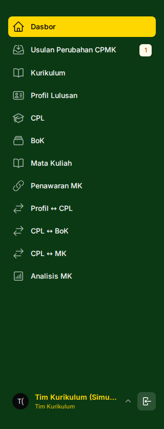


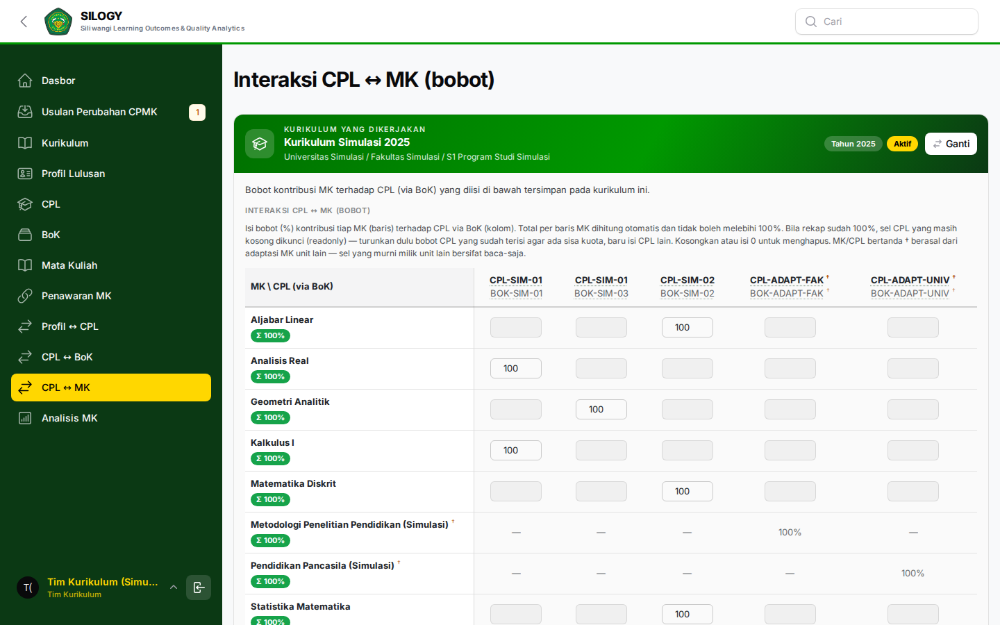

✅ *Output:* matriks kurikulum (Profil → CPL → BoK → MK) lengkap.

---

## TAHAP 3 — Pembentukan kelas & penugasan dosen (Admin Prodi + Tim Kurikulum)

1. **Admin Prodi** — **Kelas → Kelas MK**: buat kelas untuk tiap MK pada semester aktif, tambahkan peserta (mahasiswa).
2. **Set dosen MK** (Admin/Tim Kurikulum): tetapkan **Dosen Pengampu** untuk setiap kelas/MK.

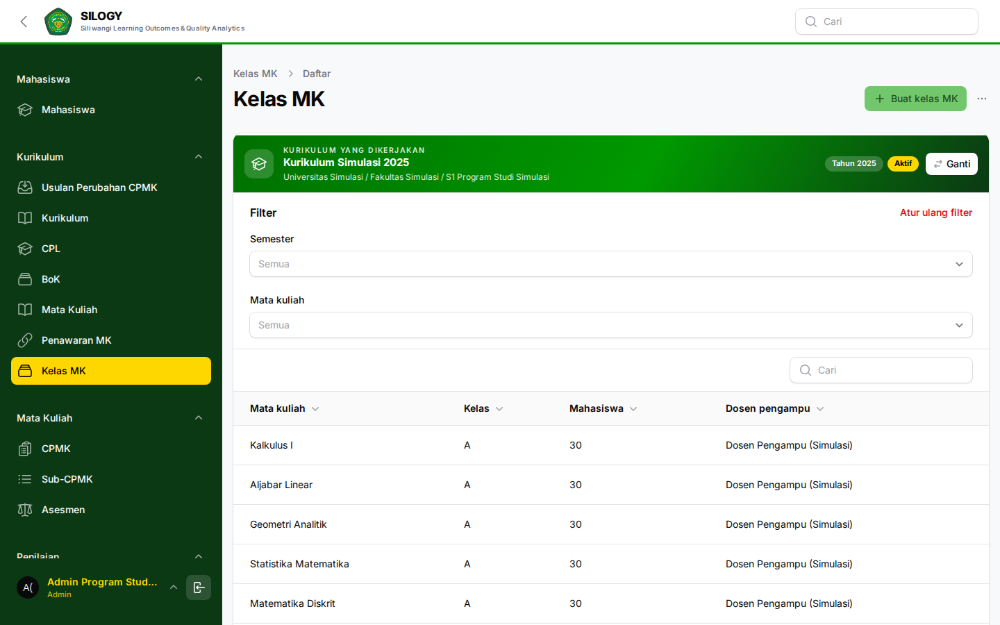

✅ *Output:* kelas terbentuk dengan dosen pengampu.

---

## TAHAP 4 — Perancangan penilaian (Koordinator Mata Kuliah)

**Login sebagai `korma`.**

1. **Mata Kuliah → CPMK**: rumuskan CPMK tiap MK, kaitkan ke CPL.
2. **Mata Kuliah → Sub-CPMK**: rincikan Sub-CPMK di bawah tiap CPMK.
3. **Penilaian → Komponen Penilaian**: tetapkan komponen (Tugas, Kuis, UTS, UAS, dll.) + **bobot (%)**, kaitkan ke Sub-CPMK/CPMK. Pastikan total bobot = 100%.

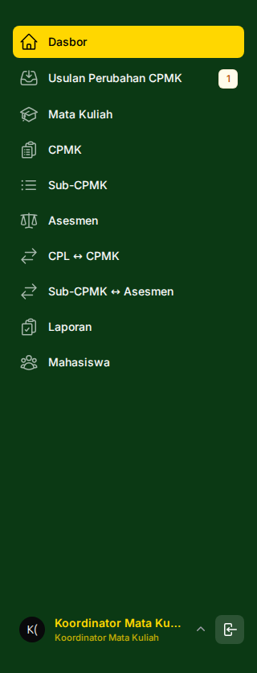

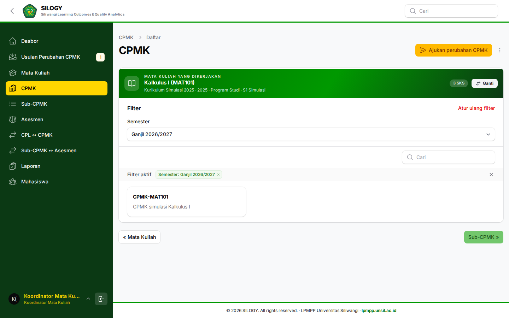


✅ *Output:* struktur penilaian siap diisi nilai.

---

## TAHAP 5 — Pelaksanaan & input nilai (Dosen Pengampu)

**Login sebagai `dosen`.**

1. **Kelas → Kelas MK**: pastikan kelas yang diampu benar.
2. **Penilaian → Input Nilai**: pilih kelas & MK, isi nilai tiap mahasiswa per komponen, **Simpan**.
3. *(Alternatif massal)* **Import Nilai**: unduh template → isi → unggah → konfirmasi → periksa baris gagal.

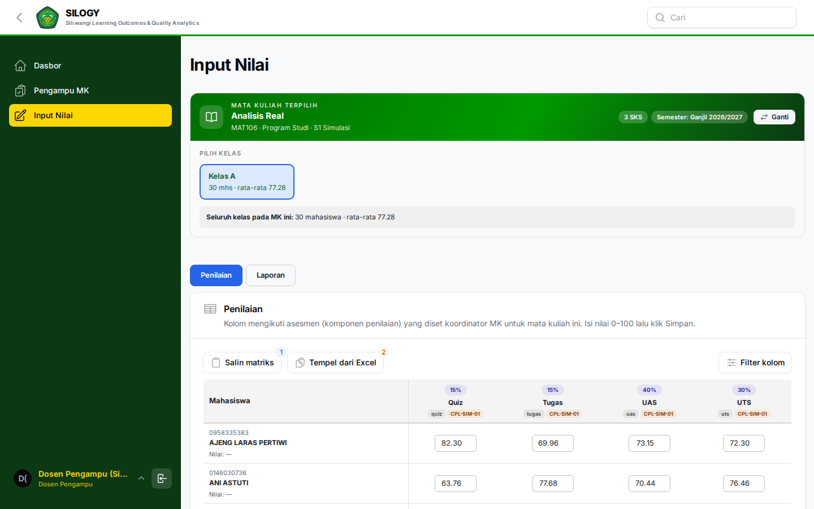

✅ *Output:* nilai mahasiswa lengkap; ketercapaian CPMK/Sub-CPMK terhitung.

---

## TAHAP 6 — Monitoring, analisis & audit (Pimpinan & Auditor)

1. **Pimpinan** (`kaprodi`/`dekan`/`rektor`) — **Dashboard/Laporan**: tinjau ketercapaian CPL/CPMK pada unit.
2. **Pimpinan** — **AI Analisis → Minta Analisis**: ajukan analisis (pilih lingkup unit/semester/MK) → cek hasil di **Riwayat Analisis**.
3. **Pimpinan/Admin** — **Ekspor data**: unduh laporan untuk akreditasi/rapat.
4. **Auditor Mutu** (`auditor`) — **Audit → Log Aktivitas**: telusuri jejak perubahan; **Laporan**: telaah kelengkapan & kepatuhan.


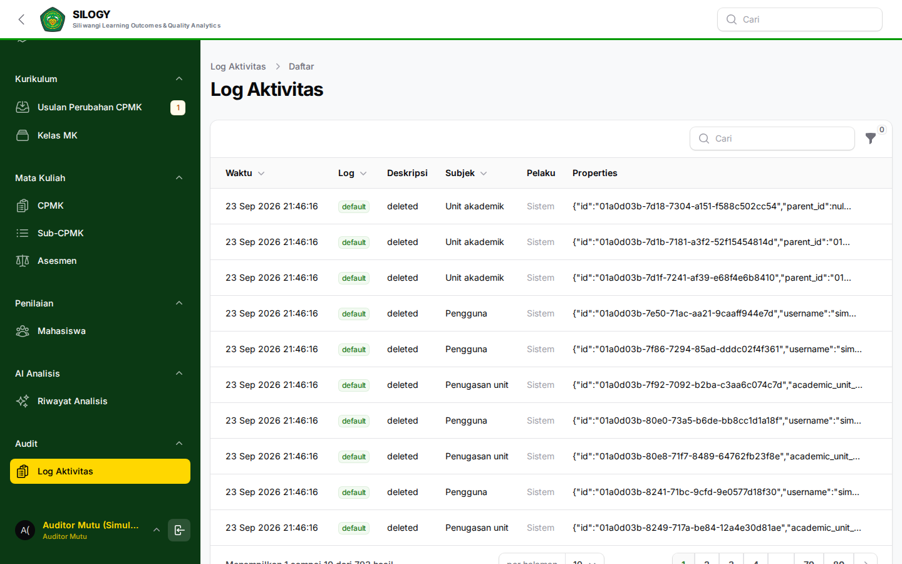

✅ *Output:* laporan ketercapaian, analisis AI, dan bukti audit.

---

## Dua cara mencoba di ruang latihan

Simulasi hanya tersedia di tingkat **Program Studi**. Panduan tingkat Universitas dan Fakultas tetap dapat dibaca di halaman panduan, tetapi tombol cobanya diganti keterangan bahwa simulasi difokuskan pada Program Studi.

Pada halaman panduan, setiap peran pengisi (Admin Unit, Tim Kurikulum, Koordinator MK, Dosen Pengampu) menawarkan dua pilihan:

| Pilihan | Isi data | Sifat | Dipakai untuk |
|---|---|---|---|
| **Lihat contoh terisi** | Satu program studi dengan kurikulum, CPL, BoK, MK, CPMK, komponen, sampai nilai sudah terisi | Satu salinan **dipakai bersama** semua pengunjung dan **hanya dapat dibaca** | Melihat seperti apa hasil akhir tiap menu |
| **Coba mengisi sendiri** | Satu program studi dengan satu kurikulum kosong dan satu mata kuliah kosong yang Koordinator MK-nya sudah ditetapkan | **Milik Anda sendiri**, dapat diubah | Mengikuti tahap 2 sampai 5 di bawah ini dari awal |

Pimpinan dan Auditor Mutu hanya membaca, sehingga keduanya hanya mendapat contoh terisi.

### Contoh terisi bersifat hanya-baca

Karena dipakai bersama, tombol simpan, ubah, dan hapus dinonaktifkan, dan setiap penulisan ke data akademik ditolak di sisi server. Pencarian, filter, dan pengurutan tabel tetap bekerja. Untuk berlatih mengisi, gunakan **Coba mengisi sendiri**.

### Urutan pada contoh kosong

Kurikulum dan satu mata kuliah sudah tersedia, dan Koordinator MK sudah ditetapkan, sehingga tidak ada peran yang menunggu pembuatan kurikulum. Urutan kerjanya:

1. **Tim Kurikulum** menyusun CPL, BoK, dan pemetaannya.
2. **Koordinator MK** memilih MK-nya, lalu menyusun CPMK, Sub-CPMK, dan asesmen. **Admin Program Studi** secara paralel menawarkan MK, membuka kelas, dan memasukkan peserta.
3. **Dosen Pengampu** mengisi nilai setelah asesmen siap dan kelas punya peserta.

Buka tiap peran di tab sendiri, lalu kerjakan berurutan.

### Keterangan "menunggu peran hulu"

Di halaman peran yang bergantung pada peran lain, ruang latihan menampilkan kotak keterangan oranye di bagian atas. Kotak itu menyebut syarat yang belum terpenuhi, peran yang harus menanganinya, dan langkah yang perlu dikerjakan. Contohnya pada Dosen Pengampu: "Koordinator MK belum menentukan tagihan penilaian", beserta alasan rincinya (CPMK belum ada, Sub-CPMK belum dibuat, total bobot asesmen belum 100%, atau asesmen belum dipetakan ke Sub-CPMK).

| Halaman | Syarat yang diperiksa | Ditangani oleh |
|---|---|---|
| Profil Lulusan, CPL | Kurikulum sudah dibuat | Tim Kurikulum |
| BoK, Mata Kuliah | CPL sudah ada; MK sudah punya Koordinator MK | Tim Kurikulum |
| Penawaran MK | Mata kuliah sudah ada | Tim Kurikulum |
| Kelas MK | MK sudah ditawarkan; kelas punya Dosen Pengampu | Tim Kurikulum, Admin Program Studi |
| Daftar MK, CPMK, Sub-CPMK, Asesmen | Anda sudah ditetapkan sebagai Koordinator MK; MK sudah dipilih; CPMK ada sebelum Sub-CPMK; Sub-CPMK ada sebelum Asesmen | Tim Kurikulum, Koordinator MK |
| Peserta, Laporan | Kelas dan peserta sudah ada; asesmen siap; nilai sudah diisi | Admin Program Studi, Koordinator MK, Dosen Pengampu |
| Pengampu MK, Input Nilai | Kelas sudah dibuat dan Anda diampu; asesmen sudah siap (total bobot 100%, terpetakan ke Sub-CPMK); kelas punya peserta | Tim Kurikulum, Admin Program Studi, Koordinator MK |

Kotak ini dihitung dari isi sandbox Anda sendiri, sehingga hilang dengan sendirinya setelah syaratnya terpenuhi. Halaman yang terkunci (403) juga menampilkan kotak yang sama, supaya Anda tahu langkah hulu mana yang perlu dikerjakan lebih dulu.

Pimpinan dan Auditor Mutu hanya membaca, sehingga keduanya hanya menyediakan contoh terisi.

Contoh terisi dan contoh kosong adalah dua ruang terpisah. Mengisi di contoh kosong tidak mengubah contoh terisi.

Contoh kosong disiapkan dari kolam siap-pakai sehingga biasanya terbuka dalam beberapa detik. Bila kolam sedang kosong, contoh dibangun saat Anda menunggu (sekitar 4 detik). Contoh yang tidak dipakai selama 120 menit dibuang otomatis.

---

## Daftar periksa keberhasilan simulasi

- [ ] Hirarki Universitas→Fakultas→Jurusan→Prodi terbentuk (pada data inti; sandbox simulasi hanya memuat satu Prodi)
- [ ] Semester aktif tersedia
- [ ] Akun tiap role dibuat dan ditugaskan ke unit yang benar
- [ ] Kurikulum: Profil Lulusan, CPL, BoK, MK, MK Unit lengkap & terpetakan
- [ ] Kelas terbentuk dengan dosen pengampu
- [ ] CPMK, Sub-CPMK, Komponen Penilaian (bobot total 100%) tersedia
- [ ] Nilai mahasiswa terinput penuh
- [ ] Dashboard menampilkan ketercapaian CPL/CPMK
- [ ] Analisis AI berhasil dijalankan
- [ ] Log audit mencatat aktivitas

---

## Catatan urutan ketergantungan

- **CPL harus ada sebelum** BoK, MK, dan CPMK (semuanya merujuk ke CPL).
- **Komponen Penilaian harus ada sebelum** Dosen dapat input nilai.
- **Nilai harus lengkap sebelum** analisis AI/laporan ketercapaian bermakna.
- **Semester aktif harus benar** sebelum membuat kelas dan input nilai.
